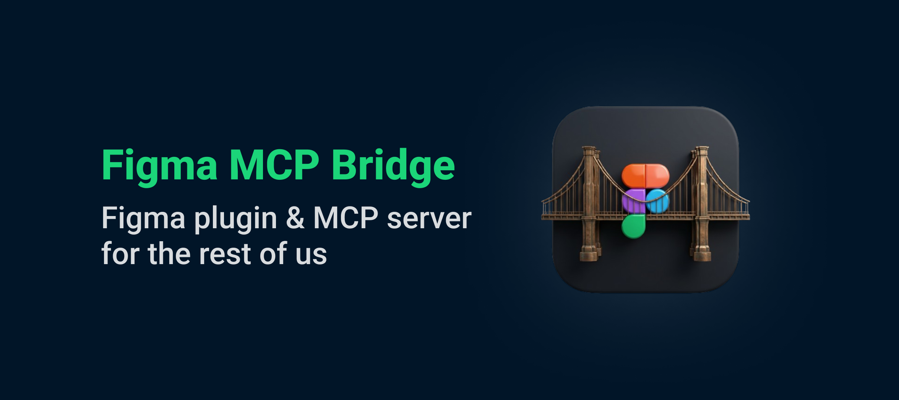

# Figma MCP Bridge

- [Demo](#demo)
- [Quick Start](#quick-start)
- [Local development](#local-development)
- [Structure](#structure)
- [How it works](#how-it-works)

<br/>



<br/>

While other amazing Figma MCP servers like [Figma-Context-MCP](https://github.com/GLips/Figma-Context-MCP/) exist, one issues is the [API limiting](https://github.com/GLips/Figma-Context-MCP/issues/258) for free users.

The limit for free accounts is 6 requests per month, yes **per month**.

Figma MCP Bridge is a solution to this problem. It is a plugin + MCP server that streams live Figma document data to AI tools without hitting Figma API rate limits, so its Figma MCP for the rest of us ✊

## Demo

[Watch a demo of building a UI in Cursor with Figma MCP Bridge](https://youtu.be/ouygIhFBx0g)

[](https://youtu.be/ouygIhFBx0g)


## Quick Start

The easier way to get started is to download the latest release from [Releases](https://github.com/figma-mcp-bridge/releases) page.

Unzip it in a location and then:

### 1. Add a development plugin to Figma

Open Figma, and then go to `Plugins > Development > Install from manifest` and drop in the `plugin/manifest.json` file from inside the folder you downloaded.

### 2. Add the MCP server to your favourite AI tool

An example configuration in Cursor:
```json
"figma-bridge": {
      "command": "node",
      "args": ["/path/to/figma-mcp-bridge/run.js"]
}
```

The `run.js` script automatically detects your OS and architecture, and runs the correct binary from the `binaries/` folder — no need to pick the right binary yourself.

### 3. Start using the MCP server 🎉

To work there is a bit of magic behind the scenes.

If you want to know more about how it works, you can read the [How it works](#how-it-works) section.

## Local development

To start you will need two things:
#### 1. Clone this repository locally

```
git clone git@github.com:gethopp/figma-mcp-bridge.git
```

#### 2. Build the server

```bash
cd server && mkdir -p ../binaries && go build -o ../binaries/figma-map-$(go env GOOS)-$(go env GOARCH) .
```

#### 3. Build the plugin

Build the plugin, and it will then be available in the `dist` folder.

```bash
cd plugin && bun install && bun run build
```

#### 4. Add the MCP server to your favourite AI tool

Add the following to your favourite AI tool's MCP config:

```json
"figma-bridge": {
      "command": "node",
      "args": ["/path/to/figma-mcp-bridge/run.js"]
}
```

## Structure

```
Figma-MCP-Bridge/
├── plugin/   # Figma plugin (TypeScript/React)
└── server/   # Go MCP server
```

## How it works

There are two main components to the Figma MCP Bridge:

### 1. The Figma Plugin

The Figma plugin is the user interface for the Figma MCP Bridge. You run this inside the Figma file you want to use the MCP server for, and its responsible for getting you all the information you need.

### 2. The MCP Server

The MCP server is the core of the Figma MCP Bridge. As the Figma plugin connects with the MCP server via a WebSocket connection, the MCP server is responsible for:
- Handling WebSocket connections from the Figma plugin
- Forwarding tool calls to the Figma plugin
- Routing responses back to the Figma plugin
- Handling leader election (as we can have only WS connection to an MCP server at a time)


```
┌─────────────────────────────────────────────────────────────────────────────┐
│                              FIGMA (Browser)                                │
│  ┌───────────────────────────────────────────────────────────────────────┐  │
│  │                         Figma Plugin                                  │  │
│  │                    (TypeScript/React)                                 │  │
│  └───────────────────────────────────────────────────────────────────────┘  │
└─────────────────────────────────────────────────────────────────────────────┘
                                      │
                                      │ WebSocket
                                      │ (ws://localhost:1994/ws)
                                      ▼
┌─────────────────────────────────────────────────────────────────────────────┐
│                          PRIMARY MCP SERVER                                 │
│                         (Leader on :1994)                                   │
│  ┌─────────────────────────────────────────────────────────────────────┐    │
│  │  Bridge                                    Endpoints:               │    │
│  │  • Manages WebSocket conn                  • /ws    (plugin)        │    │
│  │  • Forwards requests to plugin             • /ping  (health)        │    │
│  │  • Routes responses back                   • /rpc   (followers)     │    │
│  └─────────────────────────────────────────────────────────────────────┘    │
└─────────────────────────────────────────────────────────────────────────────┘
                           ▲                              ▲
                           │ HTTP /rpc                    │ HTTP /rpc
                           │ POST requests                │ POST requests
                           │                              │
         ┌─────────────────┴───────────┐    ┌─────────────┴───────────────┐
         │    FOLLOWER MCP SERVER 1    │    │    FOLLOWER MCP SERVER 2    │
         │                             │    │                             │
         │  • Pings leader /ping       │    │  • Pings leader /ping       │
         │  • Forwards tool calls      │    │  • Forwards tool calls      │
         │    via HTTP /rpc            │    │    via HTTP /rpc            │
         │  • If leader dies →         │    │  • If leader dies →         │
         │    attempts takeover        │    │    attempts takeover        │
         └─────────────────────────────┘    └─────────────────────────────┘
                    ▲                                      ▲
                    │                                      │
                    │ MCP Protocol                         │ MCP Protocol
                    │ (stdio)                              │ (stdio)
                    ▼                                      ▼
         ┌─────────────────────────────┐    ┌─────────────────────────────┐
         │      AI Tool / IDE 1        │    │      AI Tool / IDE 2        │
         │      (e.g., Cursor)         │    │      (e.g., Cursor)         │
         └─────────────────────────────┘    └─────────────────────────────┘
```

